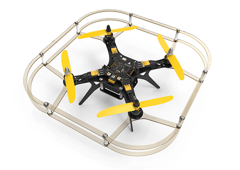

.. """Пионер""" documentation master file, created by
   sphinx-quickstart on Mon Sep 10 13:58:08 2018.
   You can adapt this file completely to your liking, but it should at least
   contain the root `toctree` directive.

Geoscan Pioneer documentation
======================================================

`Return to Pioneer webpage`_
---------------------------------
.. _Return to Pioneer webpage: https://www.geoscan.aero/en/pioneer/

| Geoscan Pioneer is a multifunctional educational complex. It was developed for schools, robotics labs and for individual use.

Use Pioneer to:

*	study the robotics and avionics basics
*	get to know the principles of quadcopter constuction
*	master your flying skills
*	tailor the drone to suit your needs and tasks
*	program the drone

.. important:: Pioneer’s functional abilities can be extended by adding and programming extension modules.

.. csv-table:: Technical specs
   :header: "Parameter", "Value"

   "Class", "quadcopter"
   "Flight time", "up to 17 minutes"
   "Airspeed", "up to 65 km/h"
   "Weight", "230 g"
   "Max takeoff weight", "230 g"
   "Dimensions", "290 x 290 x 120 mm"
   "Motors","Brushless 1306 3100KV"
   "Battery","LiPo 2S 1300 mAh 9.62 Wh"
   "Max flight distance","500 m"
   "Max wind speed","up to 5 m/s"
   "Operation temperature","From 0 to +40 °C"

.. toctree::
   :maxdepth: 3
   :caption: Content:

   const/const_main
   settings/settings_main
   flight/flight
   module/module_main
   programming/programming
   indoor_nav
   FAQ
   changelog

Данное руководство содержит информацию в объеме, достаточном для полного освоения комплекса Геоскан "Пионер", его сборки, пилотирования и программирования.

